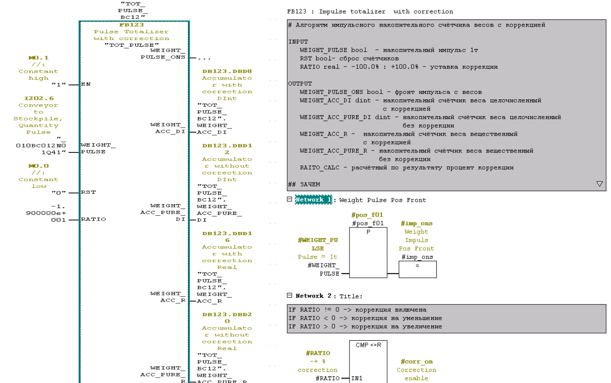

# Алгоритм импульсного накопительного счётчика весов

## Назначение
Алгоритм предназначен для точного подсчёта веса на конвейере с учётом коррекции погрешности измерения. Он решает проблему накопления ошибок при работе с вещественными числами в системах автоматизации. Разработан и протестирован на контроллере Siemens S7-400 в среде программирования Step7.

## Проблема
Оригинальный счётчик весов 12 конвейера добавляет в аккумулятор (DINT) 1 тонну по каждому дискретному импульсу от весов. При попытке перевести аккумулятор в REAL и добавлять по 0.83 тонны каждый импульс возникла проблема с вещественными числами с плавающей точкой:
- Невозможно складывать числа, значительно отличающиеся по порядку
- Пример: `45000000.0 + 0.8 = 45000000.0` (ничего не добавляется)
- Проблема связана с особенностями стандарта IEEE 754 (например, `0.2 + 0.2 != 0.4`)

## Решение
Разработан алгоритм коррекции накопительного веса на основе пропуска-добавления импульсов, где:
- 100 импульсов = 100 тонн
- Реализована система коррекции с различными процентами

### Корректировка -17%
1. Игнорируется каждый 6-й импульс (100 / 17% ≈ 5.88 → округляем до 6)
2. Погрешность: 0.33% (17% - 16.66% = 0.33% или +3.4 кг на тонну)
3. Компенсация: каждые 303 импульса игнорируется дополнительный импульс

### Корректировка +17%
1. Добавляется 1 тонна каждые 6 импульсов
2. Погрешность: 0.34% (17% - 16.66% = 0.34% или -3.4 кг на тонну)
3. Компенсация: каждые 304 импульса добавляется дополнительная тонна

### Корректировка -16%
1. Игнорируется каждый 6-й импульс (100 / 16% ≈ 6.25 → округляем до 6)
2. Погрешность: 0.66% (16% - 16.66% = -0.66% или -6.6 кг на тонну)
3. Компенсация: каждые 151 импульс добавляется дополнительная тонна

### Корректировка +16%
1. Добавляется 1 тонна каждые 6 импульсов
2. Погрешность: 0.66% (16% - 16.66% = -0.66% или +6.6 кг на тонну)
3. Компенсация: каждые 151 импульс игнорируется дополнительный импульс

## Преимущества
- Точный подсчёт веса без использования вещественных чисел
- Компенсация накапливающихся погрешностей
- Простота реализации в системах автоматизации
- Предсказуемое поведение алгоритма
